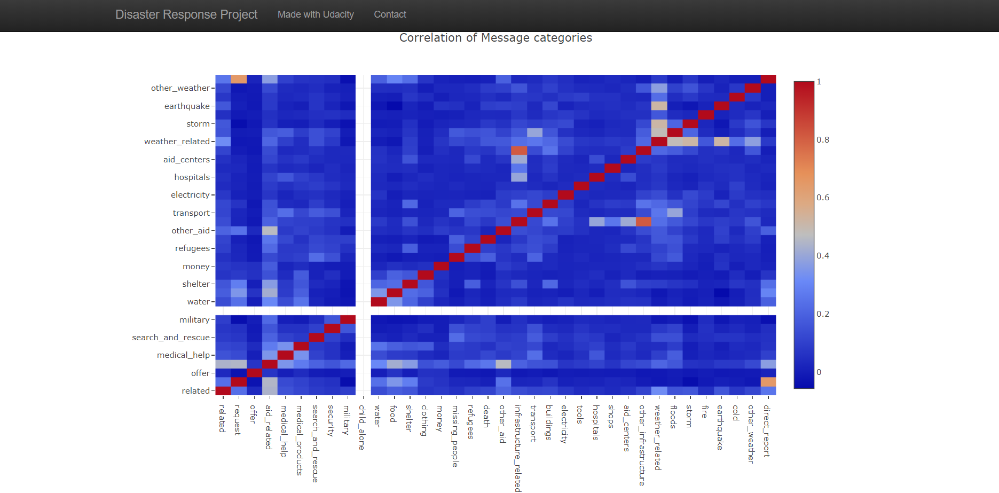
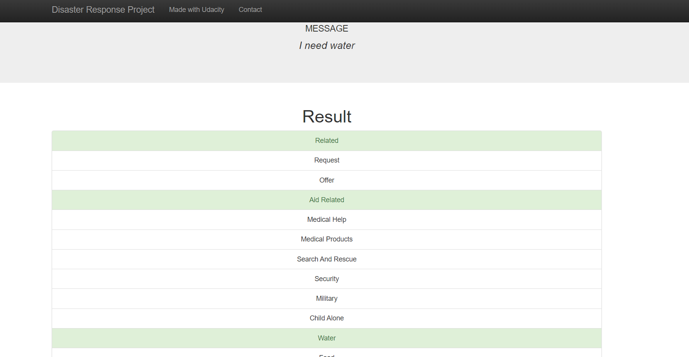

# Udacity-DS-Nanodegree_Project1: Disaster Response Pipeline Project

This is my third project in the Udacity Nanodegree program.
The dataset was provided by Figure Eight and code templates by Udacity
This project analyzes disaster data to build a model for an API that classifies disaster messages to the right category

# Libraries

The following libraries were used:
- pandas
- sqlAlchemy
- pickle
- NLTK
- sklearn
- json
- plotly
- flask
- sys
- re

# Files in the repository 

- app  
| - template  
| |- master.html  : main page of web app  
| |- go.html  : classification result page of web app  
|- run.py  : flask file that runs app

- data  
|- disaster_categories.csv  : csv data to process   
|- disaster_messages.csv  : csv data to process  
|- process_data.py : python script to process data  
|- DisasterResponse.db   : database to save clean data  

- models  
|- train_classifier.py : python script to train and classify model  
|- classifier.pkl  : saved model 

- screenshots : screenshots of app  
|- pic1.png  
|- pic2.png  
|- pic3.png  
|- pic4.png

- README.md

# Instructions:

1. Run the following commands in the project's root directory to set up your database and model.
    - To run ETL pipeline that cleans data and stores in database
        `python data/process_data.py data/disaster_messages.csv data/disaster_categories.csv data/DisasterResponse.db`
    - To run ML pipeline that trains classifier and saves
        `python models/train_classifier.py data/DisasterResponse.db models/classifier.pkl`

2. Run the following command in the app's directory to run your web app.
    `python run.py`

3. Go to http://0.0.0.0:3001/

# Project Summary
This project uses data sourced by Figure Eight to build a model for an API that classifies disaster messages into categories. There are 36 possible categories and these are:
- Related, Request, Offer, Aid Related, Medical Help, Medical Products, Search And Rescue, Security, Military, Child Alone, Water, Food, Shelter, Clothing, Money, Missing People, Refugees, Death, Other Aid, Infrastructure Related, Transport, Buildings, Electricity, Tools, Hospitals, Shops, Aid Centers, Other Infrastructure, Weather Related, Floods, Storm, Fire, Earthquake, Cold, Other Weather, and Direct Report.

This dataset is really unbalanced, with some message categories having little train data as is made obvious in picture 2 in the screenshots header below.  
An example is "Related" category which has a lot of train_samples, thus almost all future queries would show up in the "Related" category.  
Nothing was done to address this unbalanced dataset.  
To estimate performance: Precision, Recall and F1_score were used instead of accuracy to account for this skewness in data

The code template was provided by Udacity. I worked on three scripts (process_data.py, train_classifier.py, and run.py), and added the screenshots folder. Here is a brief summary on what I achieved per script:

### Process_data.py

This file takes in the path to two csv files and the Database name and does the following:
- Merges both csv files
- Expands "categories" column
- Extracts column name and column value from "categories" string provided
- Removes all duplicates
- Saves clean data as a table in Database

### Train_classifier.py

This file takes in the path to the Database from process_data.py and pickle file name and does the following:
- Creates a custom tokenizer to normalize, tokenize, lemmatize and remove all stop words
- Creates a custom Estimator class that appends True if starting word in any of the sentences is a Verb or, False otherwise
- Builds an ML pipeline using GridSearchCV to iterate through all specified parameters and find best performers
- Evaluates model and prints out precision, recall, f1_score and accuracy across 36 message categories
- Saves model as a pickle file

I initially used a RandomClassifier, but performance (f1_score) was surpassed by AdaBoostClassifier. I excluded that from this script because of computation time. 

I also reduced the parameters for GridSearchCV and reduced cross validation to 3 folds as opposed to the default 5 folds to reduce computation time. 

Even with these adjustments, my code still takes ~2.5 hours to complete

### Run.py

I made edits to this file to include two extra visualization titled: 
- Distribution of Message Categories
- Correlation of Message Categories

I also, added relevant classes to enable my model predict on future data points

# Screenshots from Flask App

The first screenshot was part of the template provided:
  

The second screenshot shows the distribution of message categories, which is really skewed:

The third screenshot shows the correlation between message categories. Category "child_alone" had no training data so it shows up as blank:

The final screenshot shows the result of "I need water" query. This is correctly classified as "related", "aid related" and "water"

# Acknowledgement
1) Udacity Nanodegree Data science Program for providing the starter template

2) Figure Eight for providing the datasets